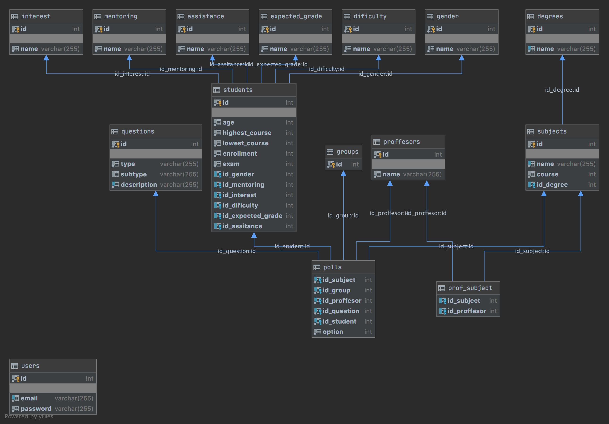

# UCA satisfaction survey
<!-- ALL-CONTRIBUTORS-BADGE:START - Do not remove or modify this section -->

<!-- ALL-CONTRIBUTORS-BADGE:END -->
Poll for student's opinion about proffesor's performance

## E-R

## Contributors ✨

Thanks goes to these wonderful people ([emoji key](https://allcontributors.org/docs/en/emoji-key)):

<!-- ALL-CONTRIBUTORS-LIST:START - Do not remove or modify this section -->
<!-- prettier-ignore-start -->
<!-- markdownlint-disable -->
<table>
  <tr>
    <td align="center"><a href="https://github.com/RubenZx"> <b>Rubén</b></a> <a href="https://github.com/krosben/uca-satisfaction-survey/commits?author=RubenZx" title="Code">💻</a> <a href="https://github.com/krosben/uca-satisfaction-survey/commits?author=RubenZx" title="Documentation">📖</a></td>
    <td align="center"><a href="https://krosf.com"> <b>Rodrigo Sanabria</b></a> <a href="https://github.com/krosben/uca-satisfaction-survey/commits?author=KROSF" title="Code">💻</a> <a href="https://github.com/krosben/uca-satisfaction-survey/commits?author=KROSF" title="Documentation">📖</a> <a href="#infra-KROSF" title="Infrastructure (Hosting, Build-Tools, etc)">🚇</a></td>
  </tr>
</table>

<!-- markdownlint-enable -->
<!-- prettier-ignore-end -->
<!-- ALL-CONTRIBUTORS-LIST:END -->

This project follows the [all-contributors](https://github.com/all-contributors/all-contributors) specification. Contributions of any kind welcome!